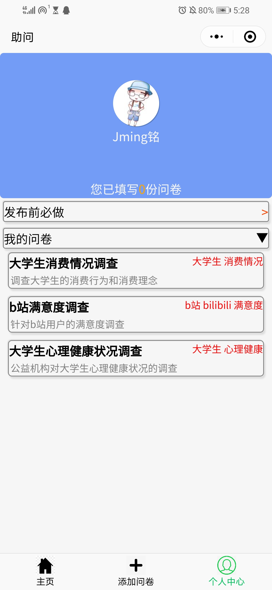
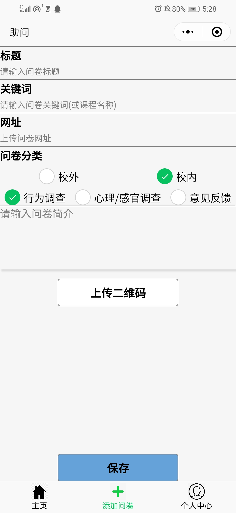
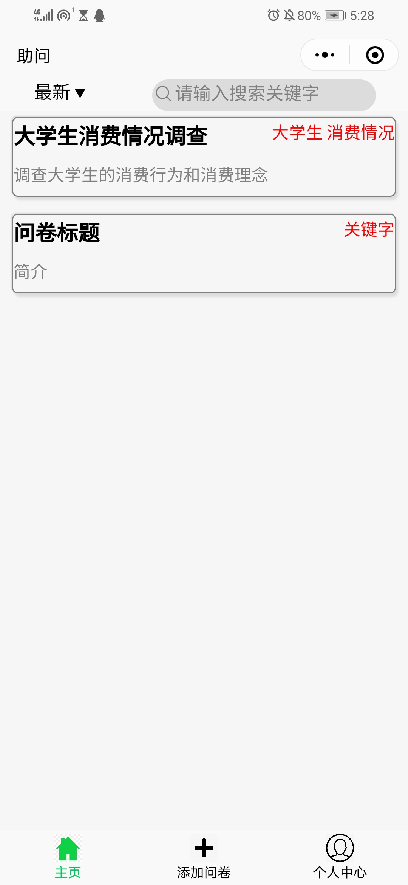

# 助问小程序

## 效果展示

#  一、小程序说明 
    助问小程序是一款校园问卷分享平台，它跟问卷星小程序对接，有对问卷的统计（填写 次数，发布次数，填写人数）、平台发布分享、问卷的分类和显示等功能 
# 二、应用场景 
    1.为学生个人设置的问卷分享平台 
    2.校内组织通过问卷平台后台数据给予填写、发布学生一定的激励（如综测） 
    3.校内学生填写他人问卷获取综测/问卷星红包 的奖励 
    4.校外个体/组织针对学生的问卷分享平台 
# 三、解决的实际问题 
    就目前而言，校内学生的课程设计或研究项目要想通过问卷调查获取分析用的数据，只 能靠组内成员在各自的社交圈子（微信群、朋友圈）里分享问卷星的链接，这样获取数据不 仅因为激励手段匮乏且效果不大（朋友的感谢、红包等）导致数据量不足，而且获取到的数 据范围狭隘，普遍性不足，很难达到课程设计或研究项目的要求。 因此，希望能够通过综测这项更能激励学生群体的制度来激励更多的学生填写问卷，为 此校内组织需要获取填写、发布问卷的数据作为奖励依据，也为了给与校内学生或校外的问 卷一个分享发布的平台，助问小程序就是建立在这两样需求上构思起来的 
# 四、技术开发方案（包括小程序端和后台服务器端） 
### 1. 小程序端--微信开发者工具开发，用微信小程序的框架及开发能力 
    1. 首页--查询（分类、关键字、排序）、显示问卷（分页显示、下拉刷新） 问卷板块点击会跳转到相应的问卷星小程序页面（会先检测授权） 
    2. 问卷添加页面--添加问卷的标题、关键字、类别、简介 保存按钮在将问卷保存至数据库前会先检测授权（需要获取 openid） 
    3. 个人中心--显示用户头像、昵称、已填写的问卷数、已发布的问卷 页面显示时检测授权，否则需要点击登录按钮才能获取用户数据 
    4. 注意事项（发布前必做事项的说明） 
    5. 底部 tabbar 进行页面分发跳转 
### 2. 后台服务端 
    1.通过云开发技术搭建后台数据库和访问管理手段 
    2.页面的路由跳转逻辑通过微信的小程序开发框架放在每一个 page 相关的 js 文件 中 